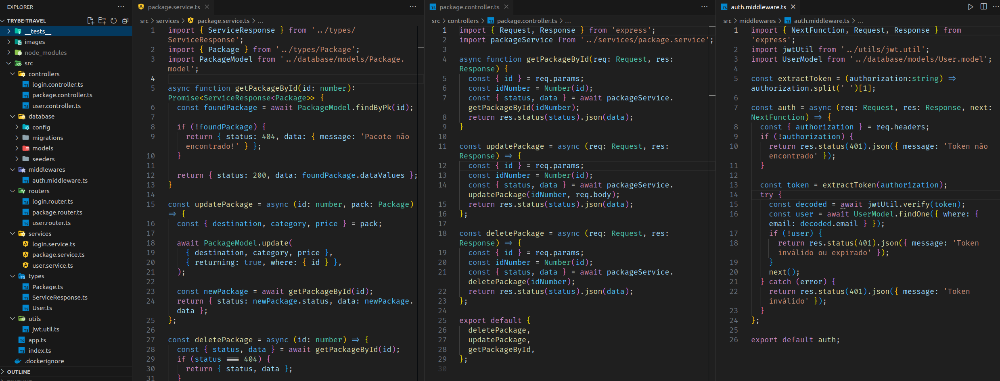

# README: Trybe Travel



## Project Description

The purpose of this project is to create an API responsible for managing a travel agency. The Sequelize ORM is utilized for handling the database and its relationships, along with the implementation of a RESTful API following the MSC layered architecture using TypeScript. Additionally, authenticated routes are implemented using JWT for enhanced security.

### Technologies

- LINUX
- VSCODE
- NODE.JS
- MYSQL
- JAVASCRIPT
- SEQUELIZE
- EXPRESS
- JSON WEB TOKEN

### What I Learned

- How to develop a post and get route using TypeScript, Express, and Sequelize.
- How to extract contracts in the implementation between two software components.

## How to Run the Project

1. Clone the repository:

   ```bash
   git clone https://github.com/feduarte-dev/trybe-travel
   ```

2. Navigate to the project directory:

   ```bash
   cd your-repository
   ```

3. Initiate the containers

   ```bash
   docker-compose up -d
   docker exec -it trybe_travel bash
   ```
   
4. Install dependencies inside container:

   ```bash
   npm install
   ```

5. If you want to run migrations and seed:

   ```bash
   npm run db:reset
   ```
5. If you want to run tests:

   ```bash
   npm run test
   ```

## Contributions

[Felipe](https://www.linkedin.com/in/feduarte-dev/) - /controller - /middlewares - /routes - /services - /types - /utils - /tests

[Trybe](https://www.betrybe.com/) - Everything else
